# Purpose
This document covers to create ADO pipeline from a new/existing project with service connection.

# Table of Contents
- [Scenario 1: New-Project-First-Pipeline](#scenario-i-if-it-is-a-new-project-github-service-connection-will-not-be-there-then-how-to-create-new-pipeline-in-ado)
- [Scenario 2: Other-Pipeline-Exists-Adding-New-Pipeline](#scenario-2-if-this-is-an-existing-project-with-at-least-one-pipeline-then-how-to-create-a-new-pipeline-with-service-connection)

### Scenario-I: If it is a new project, GitHub service connection will not be there, then how to create new pipeline in ADO.   

To create an ADO (Azure DevOps) pipeline, you need to follow these steps: 

1. Sign into Azure DevOps account - [Projects - Home (azure.com)](https://dev.azure.com/premierinc/)

    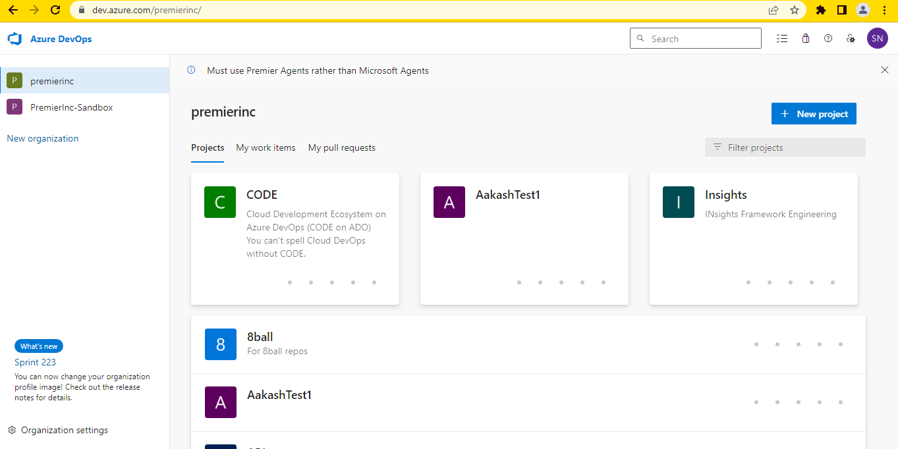
2. Navigate to your project for example "Sandbox" is your new project use search bar in right side and click on your project.

    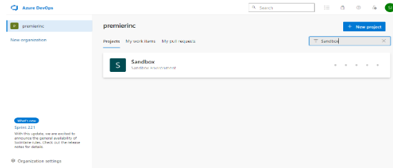

3. Go to "Pipelines" section - [Pipelines - Recent (azure.com)](https://dev.azure.com/premierinc/Sandbox/_build), In the Right menu, select "New Pipeline".

    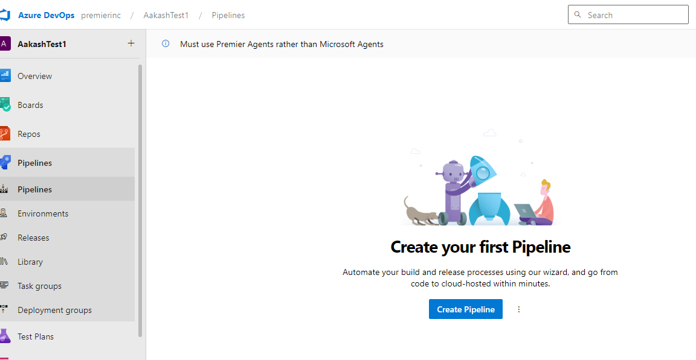

4. Select GitHub 

    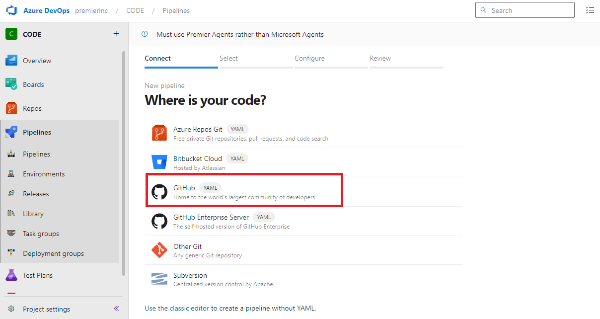
5. You will be taken for authorization. Click continue to authorize. 

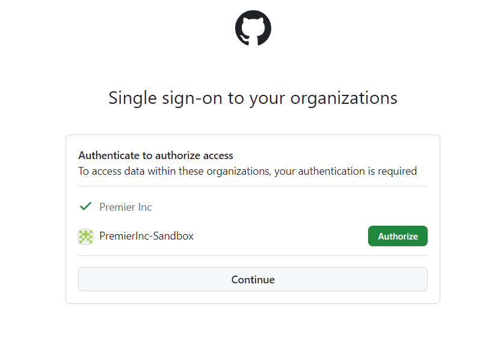

6. In Select repository section, choose "All repositories" 

    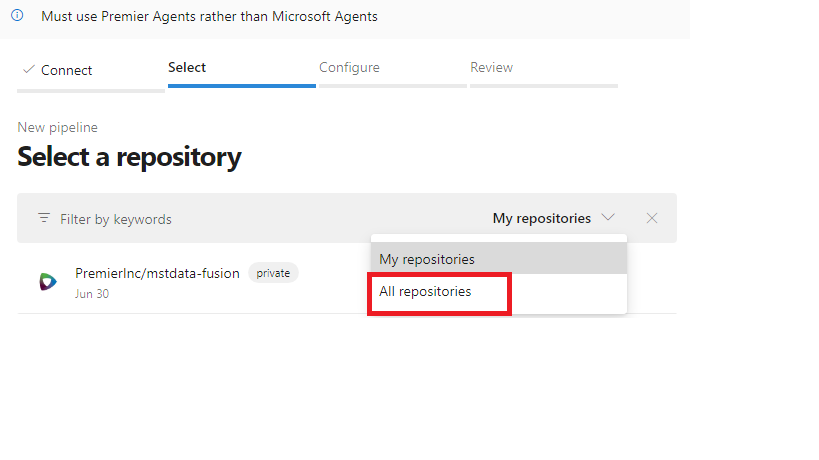

- Select a repository where your project code resides.

7. Configure the pipeline: 

- If it is a new pipeline, select starter pipeline and it will provide basic default pipeline in YAML format. 
- If your repository has pipeline already, select the branch and path, where the pipeline resides. Click continue.
    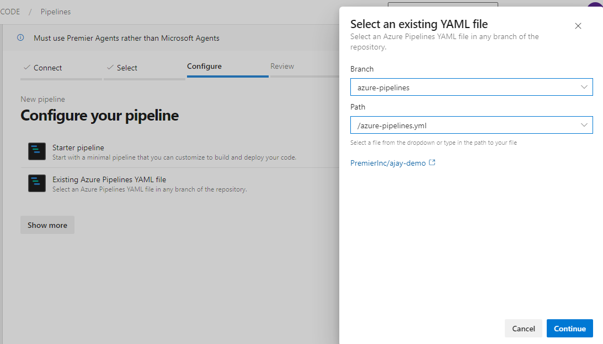
- Once pipeline from repository gets generated, click Save and run. This will trigger a build of your code and generate an artifact.
    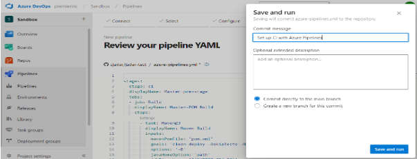

- You can add additional steps to your pipeline, such as testing, deploying, or publishing artifacts, by editing the YAML code.

### Scenario-2: If this is an existing project with at least one pipeline, then how to create a new pipeline with service connection

1. Sign into your Azure DevOps account

   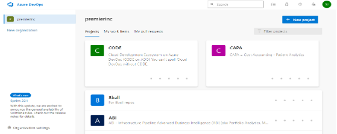

3. Navigate to your project for example "Sandbox" is your project use search bar in left side and select your project. 
    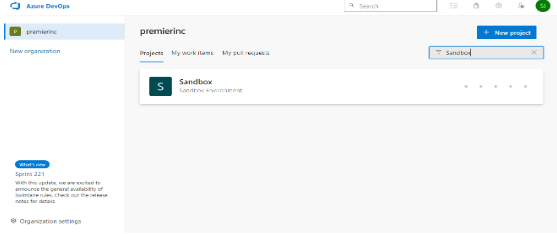

4. Go to  "Pipelines" section. In the Right-hand menu, select "New Pipeline" and click on "Create Pipeline." 
    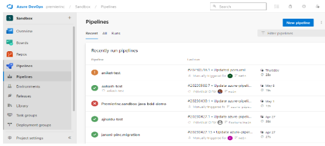

5. Choose "GitHub" to select repository
    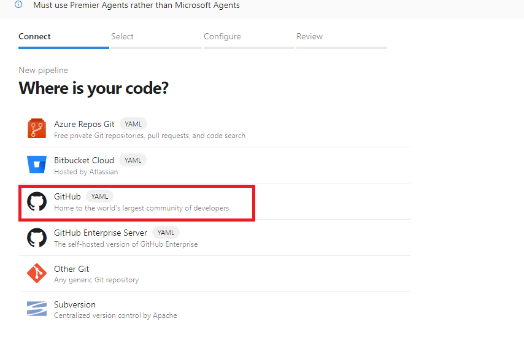

6. Click "Continue" to authorize.
    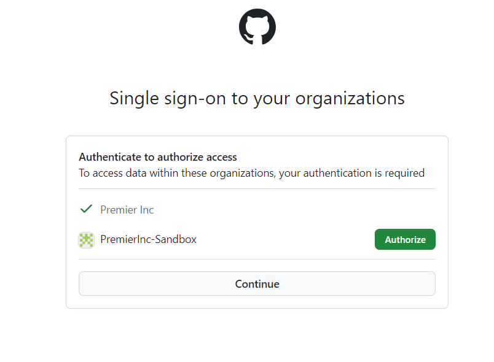

7. Once authorized, scroll down to the bottom and click "You may also select a specific connection" 
    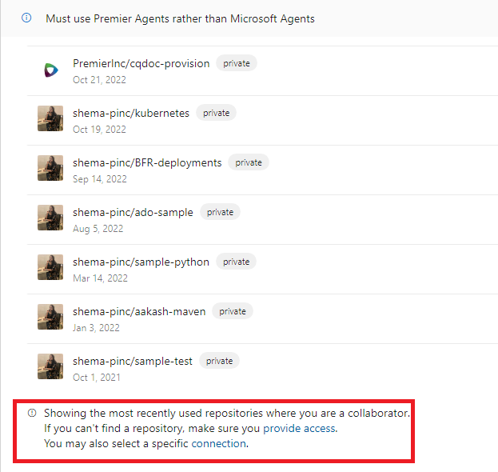

8. Select repository from "PremierInc" organization.
    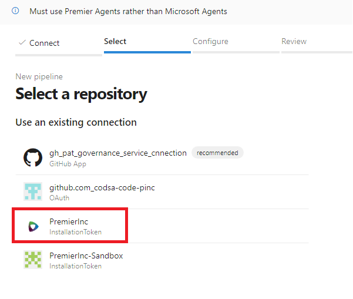
9. Search for your repository and select. 

10. Configure the pipeline: 

- If it is a new pipeline, select starter pipeline and it will provide basic default pipeline in YAML format. 
- If your repository has pipeline already, select the branch and path, where the pipeline resides. Click continue.
    
- Once pipeline from repository gets generated, click Save and run. This will trigger a build of your code and generate an artifact.
    

- You can add additional steps to your pipeline, such as testing, deploying, or publishing artifacts, by editing the YAML code.

