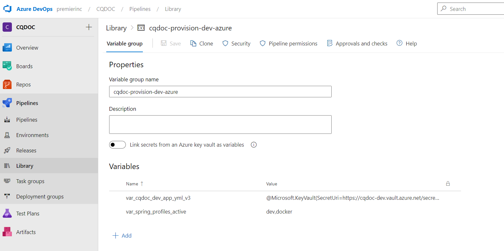

# Purpose
Follow this document if you use maven to build your docker image and push to ACR and deploy to Azure App service.

# Pre-requisite
- Follow steps [here](../../troubleshooting.md#azure-arm-service-connection) to create ARM Service Connection.

- App service name will be provided by cloud devops team. No need Service connection for this in ADO. 

- App service does not expect your app to run on SSL mode. So disable SSL/Keystore in your application.

- If you are using Truststore in your application, make sure you use default JAVA JDK Truststore and add custom certificates to that and use that. Or else, app insights in azure cloud won't work.  Check your entrypoint.sh script if you have in your source code. 

# Steps
- In the `pom.xml` file, under "docker maven plugin" make sure the image name and alias is set to `${project.artifactId}`
  ```xml
  <image>
    <name>${project.artifactId}</name>
    <alias>${project.artifactId}</alias>
    <build>
      <from>dtr.premierinc.com/code_org/core:11</from>
      <tags>
        <tag>latest</tag>
        <tag>${project.version}</tag>
      </tags>
  ```
- In the `pom.xml` file, comment the below docker-push execution. This prevents from pushing the image at the build stage.  This prevents the maven to push image to docker registry.
```xml
					<!-- <execution>
						<id>docker-push</id>
						<phase>deploy</phase>
						<goals>
							<goal>push</goal>
						</goals>
					</execution> -->
```
- We push the image to ACR during the deploy step and then deploy to Azure app service. Refer to `pipeline/deploy.yaml` file.
- We need library groups to store **configurations** for your app services.
  - in this example, we have created "library group" `cqdoc-provision-dev-azure` that contains the key/value pairs. The below keys are mandatory as they are used in `deploy.yaml` file. 
    | Name | Value | 
    | --- | --- |
    | var_acr_name | lmsdevacr |
    | var_az_app_service_rg | RG_CommonEast_LMS | 
    | var_az_app_service | lms_config_service | 
    | var_appinsights | AppInsightsName | 
    
    

- This example allows you to do `blue_green` deployment model. 
- We have templatized the pipeline files and check the `pipeline` directory.

