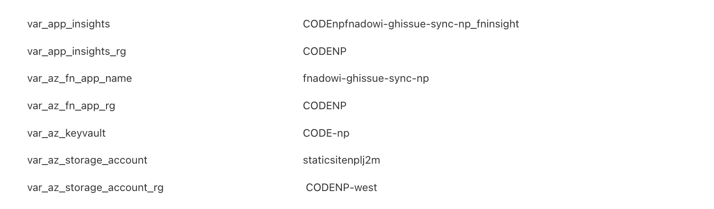

# Purpose
Build and deploy python project to azure function app.


# Pre-requisite
- `pipeline` folder has the pipeline code. Update the values according to your project
- Sample ADO library group:




> **NOTE**: This azure storage account settings and updating it in keyvault are required only if "AzureWebJobsStorage" is not configured during azure function app creation by terraform. I wish the Terraform script does it and if its not, then you can follow the storage account related configurations.


# Example project
This is example and no need to follow if you know how to test your function app locally. 

## Pre-requisites
- Create the `local.settings.json` file in the root directory and add the required configurations.
```json
{
    "IsEncrypted": false,
    "Values": {
        "AzureWebJobsStorage": "",
        "FUNCTIONS_WORKER_RUNTIME": "python",
        "GITHUB_TOKEN": "XXXXXXXXXXXXXXXXXXXXXXXXXXXXXXXXXXXXXXXX",
        "GITHUB_ORG": "PremierInc",
        "ADO_ORG": "PremierInc",
        "ADO_TOKEN": "xxxxxxxxxxxxxxxxxxxxxxxxxxxxxxxxxxxxxxxxxx",
    },
    "logging": {
        "logLevel": {
        "default": "Information",
        "Function": "Information"
        }
    }
}
```
- GitHub Token with scope: `repo`, `read:org`, `read:user`
- Azure DevOps Token with scope: `Work Items (Read & Write)`, `Project and Team (Read)`, `Identity (Read)` and select "All accessible organizations"

- Install Azure Functions Core Tools. Refer to https://learn.microsoft.com/en-us/azure/azure-functions/functions-run-local for installation instructions based on your OS.

## Running the Function App Locally
- To start the function app locally, run the command:
```bash
func start
```

## Test the Function App
- Health Check Endpoint:
```
GET http://localhost:7071/api/health
```

- Create Event Endpoint and for payload refer to `test_create_event.json`:
```
POST http://localhost:7071/api/AdoGitHubSync
```

- Update Event Endpoint and for payload refer to `test_update_event.json`:
```
POST http://localhost:7071/api/AdoGitHubSync
```
