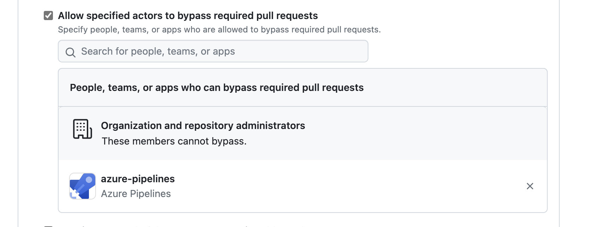

# Purpose
Some teams have requirements to push commits back to GitHub from ADO Pipeline.  This example covers the scenario. 

# Pre-requisite
- This works well for non-protected branches like `develop`, `feature`.
- In order to make it work for protected branches like `main` branch, we have to allow the `azure-pipelines` to bypass the pull-requests like below. 

- To configure branch protection in GitHub, we use [safe-settings](https://github.com/PremierInc/code-safe-settings/wiki/Full-Settings.yml) and [admin](https://github.com/premierinc/admin) repository.

> Note: Automatic trigger should not be set for this pipeline since it will create infinite loop