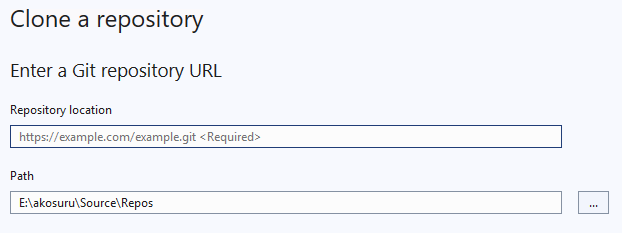
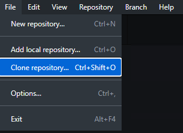

# Purpose
This document provides instructions on how to clone Azure repositories.

# Table of Contents
- [Clone via HTTPS](#Clone-via-HTTPS)
- [Clone via SSH](#Clone-via-SSH)
- [Clone via Visual Studio](#Clone-via-Visual-Studio)
- [Clone via GitHub Desktop](#Clone-via-GitHub-Desktop)

## Clone via HTTPS
(Username and Personal Access Token)

* **Step 1**: Navigate to your Azure DevOps repository.
* **Step 2**: Click on the **Clone** button (usually found in the top-right corner).
* **Step 3**: Select **HTTPS** as the protocol.
* **Step 4**: Copy the HTTPS URL.
* **Step 5**: Open your terminal or command prompt.
* **Step 6**: Run the following Git command:

  ```bash
  git clone https://dev.azure.com/{organization}/{project}/_git/{repo_name}
  ```
* **Step 7**: When prompted, enter Username and password you get from "Generate Git Credentials" option.

## Clone via SSH
(Secure Key-Based Authentication)

* **Step 1**: Ensure you have configured SSH keys in Azure DevOps (refer to the [SSH key setup guide](https://learn.microsoft.com/en-us/azure/devops/repos/git/use-ssh-keys-to-authenticate?view=azure-devops)).
* **Step 2**: Go to your repository and click the **Clone** button.
* **Step 3**: Select **SSH** as the protocol.
* **Step 4**: Copy the SSH URL.
* **Step 5**: Open your terminal.
* **Step 6**: Run the following command:

  ```bash
  git clone git@ssh.dev.azure.com:v3/{organization}/{project}/{repo_name}
  ```
* **Step 7**: If your SSH key is correctly set up, Git will authenticate automatically without prompting for a password.

## Clone via Visual Studio

* **Step 1**: Open **Visual Studio** and go to **File** & then select "Clone Repository"
* **Step 2**: Paste the HTTPS or SSH URL for your Azure repository.
  
  

  For HTTPS
  ```bash
  git clone https://dev.azure.com/{organization}/{project}/_git/{repo_name}
  ```

  For SSH
  ```bash
  git clone git@ssh.dev.azure.com:v3/{organization}/{project}/{repo_name}
  ```
  
* **Step 4**: Choose a local folder where you want to clone the repository.
* **Step 5**: Click **Clone** to start the cloning process.
* **Step 6**: Authenticate using your Azure DevOps credentials (Username and password you get from "Generate Git Credentials" option or SSH key).

## Clone via GitHub Desktop
(for GitHub-integrated Azure Repos)

* **Step 1**: Open **GitHub Desktop**.
* **Step 2**: Choose **File** > **Clone Repository**.
  
  
  
* **Step 3**: Paste the repository URL (HTTPS or SSH).

  For HTTPS
  ```bash
  git clone https://dev.azure.com/{organization}/{project}/_git/{repo_name}
  ```

  For SSH
  ```bash
  git clone git@ssh.dev.azure.com:v3/{organization}/{project}/{repo_name}
  ```
  
* **Step 4**: Authenticate with your Azure DevOps credentials (Username and password you get from "Generate Git Credentials" option or SSH key) if prompted.
* **Step 5**: Select a local path and click **Clone**.

---
These are some of the common methods to clone Azure repositories, allowing for flexibility based on preferred authentication methods and tools. Each approach offers different advantages, so choose the one that best fits your workflow.
