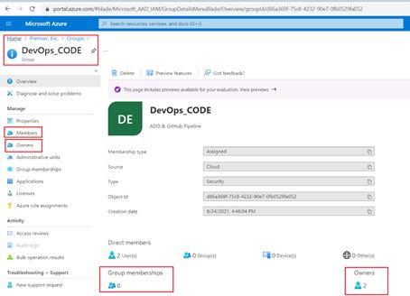
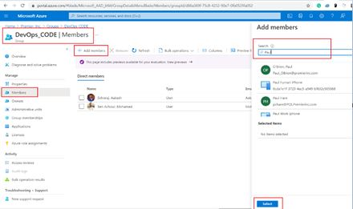

# Purpose
Follow this document for adding/removing users from Azure DevOps project.

# Steps
User provisioning is handled through Azure Active Directory Groups. We have created AD group for each and every project. For example, if your project is WFM, then AD group name is "devops_wfm"

- Log-in to https://portal.azure.com/
  > **Note**: Make sure you are in CORP Tenant and not in Member Tenant. 
  
- Search for `Microsoft Entra ID`.
- Now, you will be navigated to ‘Azure Active Directory’ home page. Here, from the left side panel click on ‘Group” menu item.
  

- Now search for `DevOps_<project>` keyword in the right panel. From the filtered list select your Azure AD Group.

>**Note**: If your AD group is not listed, please reach out to CICD Team cicdteam@premierinc.onmicrosoft.com 

- You will be navigated to your Group page as shown below. Make sure you have Owner accessibility to add users. Now, click on the ‘**Members**’ menu in the left panel.
  
  

> **Note:** Only owners has the permission to add members to the AD group. 

- Now, you will be navigated to Group’s member page as shown below. Click on `+ Add Memebers` menu button, it will popup “Add members” search panel. Now search the member you want to add & click the `Select` button.
    

- Wait for an hour for the sync to happen. 

> If you need any help please reach out to CICD Team cicdteam@premierinc.onmicrosoft.com
