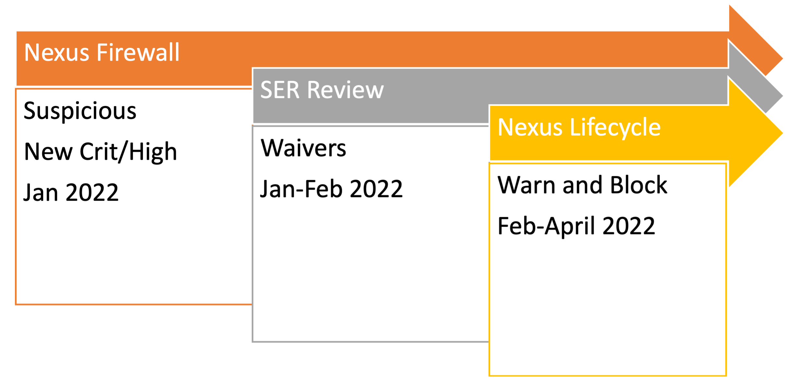

# Nexus Firewall is Live

 As Challenge #3 - _Critical and High Dependencies_ wraps up, we want to thank you for your previous and continual effort to fix OSS security vulnerabilities. We are moving to the next phase of the security practice – Prevention. Nexus Firewall is the main tool to prevent vulnerabilities from being downloaded and included in Premier applications. But it is not the only tool we will be introducing to DevSecOps.

## Timeline for Nexus

Starting **January 11th**, we are blocking all newly downloaded dependencies with critical or high vulnerabilities in Nexus Artifacts. This _may_ **NOT** have an immediate impact on your development. Teams will be prevented from downloading new Open Source Software libraries/components/tools that have critical or high vulnerabilities. This goal is to prevent new security debt from being introduced to Premier.

Through **Jan. 2022**, Security Operations and DevSecOps are reviewing the SER submissions to create necessary policy waivers. Our Nexus tools will allow only teams with approved SERs to download components that violate policy.

Starting in **Feb through April**, we are also implementing new tools to better align and support project specific configurations – Nexus Lifecycle and Advanced Developer Pack. Adding Nexus Lifecycle, we can more tactically enforce policy. Dependencies with Critical and High security risks will warn in develop/feature branch builds and break master/main/release/hotfix builds.

### Videos for Nexus Lifecycle and ADP

<https://play.sonatype.com/watch/tx7xCMzvDFk6fAXNxtSXSo?>

<https://play.sonatype.com/watch/GVCGuYcW7FSLS36DsVNz3C?>

## Integrity Rating and Quarantine

OpenSource by design is community maintained and is subject to threats from contributors. Nexus Firewall will block versions of OpenSource software that it considers suspicious. These will be reviewed by Sonatype and if safe to use, unquarantined. This is different and separate from vulnerabilities.

<https://help.sonatype.com/fw/next-gen-firewall-features/protection-from-suspicious-and-malicious-components>

<https://code.premierinc.com/docs/display/SHIELD/About+Nexus+Firewall#:~:text=What%20is%20the%20%22Integrity%2DRating%22%20policy%3F>

## DevSecOps Office Hours

We will expand the scope of our DevSecOps Office Hours to have announcements/walkthroughs/demos/conversations on all the new DevSecOps tools – Nexus Firewall/Lifecycle/IQ/Adv. Dev Pack, etc. You can follow here for [OSS](https://teams.microsoft.com/l/channel/19%3a0e58126949244c648252bcb47b937d34%40thread.skype/OSS?groupId=cd9a872e-d087-403b-a4ba-c12047f4d8fb&tenantId=b110eddf-23ae-457c-a6f3-734d592b2847) and [Nexus](https://teams.microsoft.com/l/channel/19%3a281332d41b3247a0920f98c5d2f2a6c9%40thread.skype/Nexus?groupId=8f684385-ec4d-4cee-8112-05826709b0ee&tenantId=b110eddf-23ae-457c-a6f3-734d592b2847) updates.
