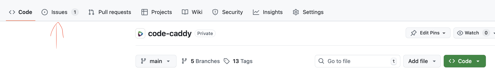
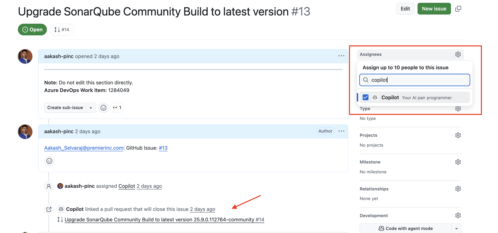
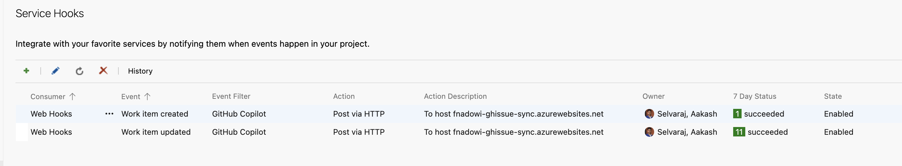
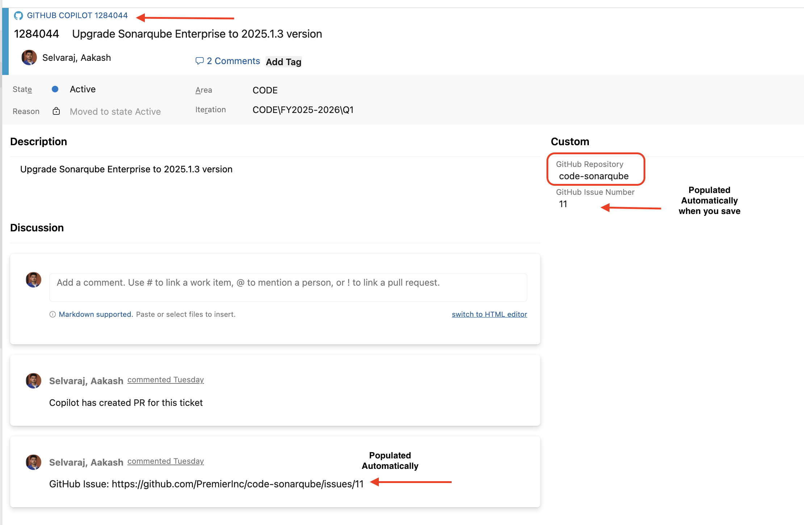
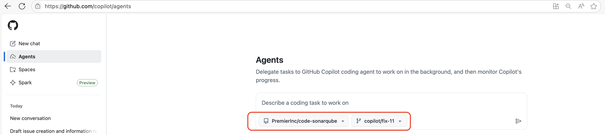

# Purpose
This document provides guidance for creating and assigning development tasks to GitHub Copilot Agent within GitHub repositories. There are two ways in which you can assign work to Copilot Agent.

- **GitHub Issue Integration** - Direct assignment through repository issues or Azure DevOps (ADO) work items.
- **GitHub Copilot Portal Interface** - Direct task assignment through the dedicated Copilot portal.

## Method 1: Assign Work to Copilot Agent via GitHub Issue

### Prerequisites
- GitHub Repository must have `Issues` Tab. If unavailable, contact GitHub Administrators at `ApplicationDelivery@premierinc.onmicrosoft.com`

  

### Manual Steps
- Person who does this must have a GitHub Copilot license.
- Go to the respective repository.
- Select the `Issues` Tab. 
- Click `New Issue`
- Fill the issue `Title` and `Description` and click `Create` button. 
- Copilot will start its work only if you assign the Issue to it. To do so, open the issue and in the `assignee`, search for `Copilot` and assign the issue to it. 

  

- Copilot creates a Draft PR and start working on the issue.

### Automated Steps via ADO work item (recommended):
- We have created an automation script that will sync the ADO Work Item to GitHub Issue and assign it to copilot to work on it. ADO Admins need to set up a webhook for this; reach out to them to configure it in your ADO project. (**Note**: This is a one-time setup).

  

- Create a work item of type `GitHub Copilot` in Azure DevOps (ADO) project.
- Give the `Title` and `description` and provide the `GitHub Repository` name.
- Once you click `save`, you will see a GitHub Issue created in the repository automatically and the Issue URL is added as comments to your ADO ticket. 

  

- When you make the ADO ticket `Active` or `In Progress`, the GitHub Issue is assigned to Copilot and Copilot will start the work. 
- By this way, you can track the work items in ADO without worrying about creating and managing the GitHub issue. 
- Adding comments in ADO Work Item will be synced to GitHub Issue.
- Closing the ADO Work Item will close the GitHub Issue. 

### Current Limitations with this Method
- At the moment copilot will create a new branch from default branch and create the Draft PR. To overcome this, follow the next method.

---

## Method 2: Assign Work to Copilot Agent via Copilot Portal
- Go to Copilot Agent portal: https://github.com/copilot/agents
- Give the detailed description of the work.
- The advantage of this method is that here you can select the repository and the branch from where the Copilot must create a new branch from. 

  

### Current Limitations
- You cannot track this work in GitHub Issue but only in Copilot portal and it is user specific. You can track the work only in GitHub Pull Request created by Copilot

**General recommendation in this approach**
- Create a work item in ADO manually.
- Ask the developer to follow this approach to assign work to Copilot agent manually. 

---

> **Note:**
> 1. To make changes to the files generated by copilot or give additional instructions to the Copilot, you have to do it in the Pull Request. 
>
> For example, `@copilot make sure you add comments to each method`
>
> 2. You can also add "Copilot" to the Pull request to review the changes made by "Copilot". It will be considered as two different Agents.

# Reference
- Video Demo of these approaches can be found [here](https://premierinc.sharepoint.com/:v:/t/CODE/ESojeInTqjJIkVc5ac2LqlkBdsUhzdJfv2pxKNVt3jxGSQ?e=Gr3BWy)
