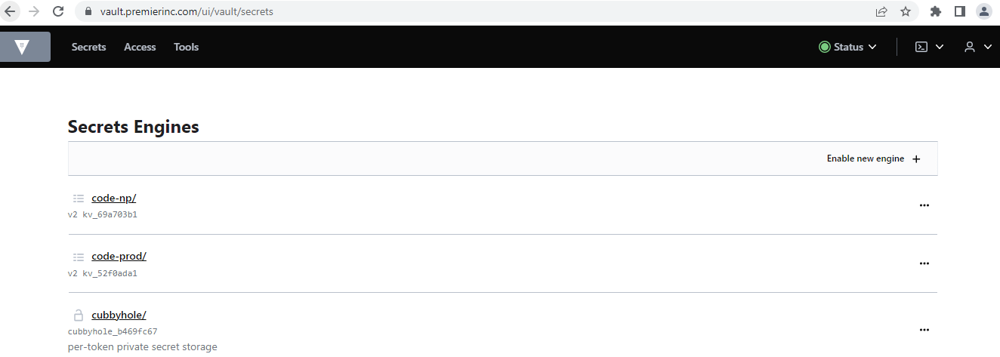
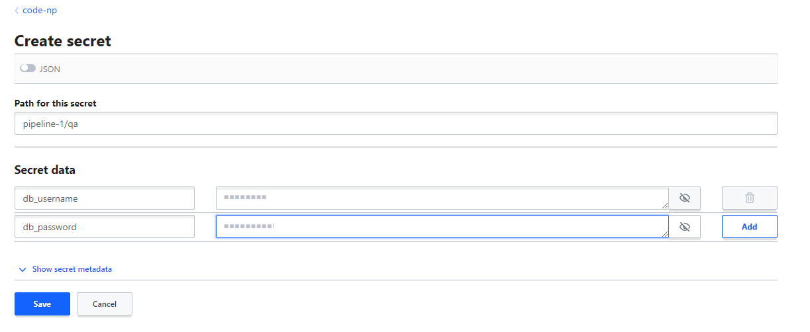

# Vault UI
Vault can be accessed by Vault CLI or by UI.

# Access UI
- Go to Vault Application URL: https://vault.premierinc.com
- Select **OIDC** in the **Method** drop down box.
- Role: Dont type anything. leave blank. It will take "Default" role. 
- Click "Sign in with OIDC provider"

# Create & Access Secrets
- Once you login, you will see the secret engines already created for your project like in below image.  If not found, please reach out to our team. We will onboard your project to vault. 

- We create two secret engines for each project: 
  - {project}-np
  - {project}-prod
- Click one of the secret engine and follow the steps given [here](https://learn.hashicorp.com/tutorials/cloud/vault-first-secrets#create-secrets) to create your first secret. 
- For example, if you want to create secrets for pipeline-1 and for dev environment, 
  - Go to {project}-np secret engine.
  - In the top right, select "Create secret"
  - You can put path "pipeline-1/qa" and then add secrets to that. 

  - Click Save.
- Congratulations, now you have created kv (key/value) secrets for your project. 

